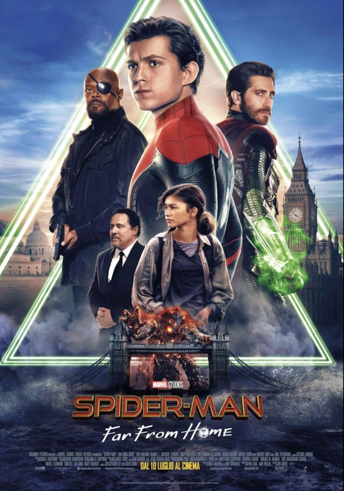
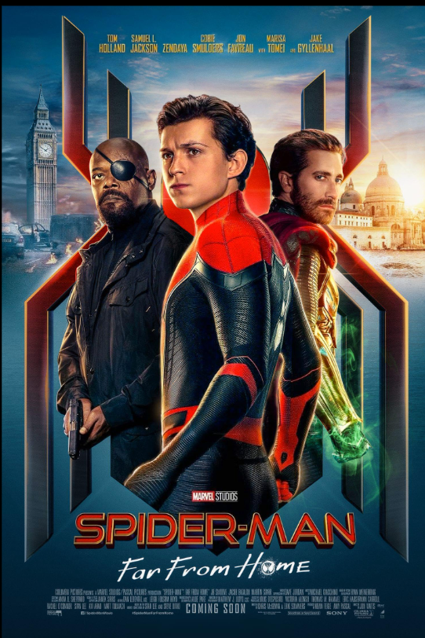

# 🕷️ Spider-Man: Far From Home



> **Spider-Man: Far From Home (2019)** is a Marvel Cinematic Universe superhero film directed by **Jon Watts**, starring **Tom Holland** as Peter Parker / Spider-Man.

---

## 🎬 Movie Overview

| Detail | Information |
|---|---|
| **Movie** | Spider-Man: Far From Home |
| **Release Year** | 2019 |
| **Genre** | Superhero, Action, Adventure, Comedy |
| **Director** | Jon Watts |
| **Main Character** | Peter Parker / Spider-Man |
| **Actor** | Tom Holland |
| **Studio** | Marvel Studios |
| **MCU Phase** | Phase Three |
| **Runtime** | 129 minutes |
| **Main Villain** | Quentin Beck / Mysterio |
| **Previous MCU Spider-Man Movie** | Spider-Man: Homecoming |
| **Next MCU Spider-Man Movie** | Spider-Man: No Way Home |

---

# 🖼️ Movie Posters

## Main Poster



## Alternate Poster


---

# 📖 Story

## Introduction

The story takes place after the events of **Avengers: Endgame**.

Peter Parker is trying to deal with the loss of **Tony Stark / Iron Man**, who was an important mentor and father figure in his life.

At the same time, Peter wants to take a break from being Spider-Man and simply enjoy his school life.

His class is going on an educational trip to Europe, and Peter hopes the trip will give him an opportunity to spend time with his friends and get closer to **MJ**.

However, Peter's plans change when a new threat appears.

---

# 🌍 Peter's European School Trip

Peter travels through several European locations with his classmates.

The trip includes:

- Venice, Italy
- Prague, Czech Republic
- Berlin, Germany
- London, United Kingdom

Peter initially wants to keep his superhero identity separate from the trip.

He plans to spend time with his friends, especially MJ, and avoid superhero responsibilities.

But Spider-Man's responsibilities follow him wherever he goes.

---

# 🧑‍🎓 Peter Parker

Peter is still struggling with the responsibilities that come with being Spider-Man.

He misses Tony Stark and is uncertain about what his future as a superhero should look like.

Peter wants to have a normal teenage life, but he realizes that extraordinary situations continue to require his help.

---

# 💥 The Elemental Creatures

During the trip, Peter encounters enormous creatures that appear to be made from natural elements.

They include creatures associated with:

- Water
- Fire
- Earth
- Air

Peter discovers that a mysterious new superhero is fighting these creatures.

This hero introduces himself as **Quentin Beck**, also known as **Mysterio**.

---

# 🦸 Mysterio


Quentin Beck claims that he comes from another universe.

According to his story, the Elementals have crossed into Peter's world and are threatening Earth.

Mysterio quickly gains the trust of Peter and several other people.

Peter believes that Beck is a powerful superhero who can help protect the world.

---

# 🤝 Nick Fury

**Nick Fury** contacts Peter and asks him to help deal with the growing threat.

Peter initially tries to avoid the mission because he wants to focus on his school trip.

Eventually, Peter accepts his responsibility and works alongside Mysterio.

Peter believes that Mysterio can handle the major threats while he focuses on protecting his friends.

---

# 🕷️ Peter and Mysterio

Peter becomes increasingly impressed by Mysterio.

He sees Beck as a more experienced superhero and believes that Beck could take over some of the responsibilities once handled by Tony Stark.

Peter eventually gives Beck access to important technology connected to Stark Industries.

This decision becomes one of the most important turning points in the story.

---

# ⚠️ The Truth About Mysterio

Peter eventually discovers that Mysterio's story is not what it appears to be.

The Elementals are not real creatures from another universe.

They are created using advanced technology, drones, holograms, and special effects.

Quentin Beck is actually using the illusion of a superhero to manipulate people.

His goal is to become famous and powerful while gaining access to Tony Stark's technology.

---

# 🧠 EDITH

One of the most important pieces of technology in the movie is **EDITH**.

EDITH stands for:

> **Even Dead, I'm The Hero**

Tony Stark leaves EDITH technology for Peter.

The system provides access to:

- Satellites
- Drones
- Intelligence systems
- Stark technology
- Advanced weapons

Peter eventually gives control of EDITH to Mysterio.

After discovering Mysterio's deception, Peter realizes that he has made a serious mistake.

---

# 🥊 The Battle Against Mysterio

Peter must regain control of the situation.

Mysterio uses advanced illusions to confuse Peter and make him question what is real.

Peter is placed in several dangerous situations where reality and illusion become difficult to distinguish.

He eventually realizes that he cannot depend only on his technology.

Peter uses his **Spider-Sense** and his own abilities to fight back.

---

# 🕷️ Spider-Man vs Mysterio

Peter confronts Mysterio in London.

Mysterio uses EDITH's drones to create a massive illusion and launch an attack.

Peter manages to navigate through the illusions and eventually reaches Mysterio.

The final confrontation proves that Peter has become more confident and capable as a superhero.

---

# ❤️ Peter and MJ

Throughout the movie, Peter's relationship with **MJ** develops.

Peter struggles to tell MJ how he feels about her.

Eventually, Peter and MJ become closer.

Their relationship becomes an important personal part of Peter's story.

---

# 📰 The Ending

After Peter returns to New York, he thinks that the situation is finally over.

He meets MJ and swings through the city with her.

However, the movie ends with a major twist.

A video released by **The Daily Bugle** reveals Spider-Man's identity to the public.

Peter Parker's secret identity is exposed.

The movie ends with Peter shocked and uncertain about what will happen next.

---

# 👥 Main Characters

## 🕷️ Peter Parker / Spider-Man

**Actor:** Tom Holland

Peter is a teenage superhero trying to balance school, friendships, relationships, and his responsibilities as Spider-Man.

In this movie, he grows emotionally and learns to make important decisions without depending entirely on Tony Stark.

---

## 🦸 Quentin Beck / Mysterio

**Actor:** Jake Gyllenhaal

Quentin Beck presents himself as a superhero from another universe.

In reality, he is the main antagonist and uses advanced technology and illusions to create a false heroic identity.

---

## ❤️ MJ

**Actor:** Zendaya

MJ is Peter's classmate and love interest.

She is intelligent, observant, independent, and increasingly important in Peter's personal life.

---

## 🤝 Ned Leeds

**Actor:** Jacob Batalon

Ned is Peter's best friend.

He accompanies Peter during the European trip and provides comic relief throughout the story.

---

## 🕵️ Nick Fury

**Actor:** Samuel L. Jackson

Nick Fury recruits Peter to help investigate the mysterious threats appearing across Europe.

---

## 👩 Aunt May

**Actor:** Marisa Tomei

Aunt May continues to support Peter while also becoming involved in charitable activities.

---

## 🤖 Happy Hogan

**Actor:** Jon Favreau

Happy is closely connected to Tony Stark and continues to look after Peter.

He helps Peter deal with Tony's legacy and provides support during the events of the movie.

---

# ⚙️ Technology

Technology plays a major role in the movie.

Important technology includes:

### EDITH

A powerful Stark system that gives Peter access to a large network of drones and other resources.

### Stark Drones

Advanced drones are used by Mysterio to create illusions and carry out attacks.

### Spider-Man Suit

Peter's suit contains advanced technology that assists him while fighting criminals and protecting people.

---

# 🧠 Major Themes

## Responsibility

Peter learns that being Spider-Man comes with responsibilities that cannot simply be avoided.

## Trust

The movie explores what happens when Peter trusts someone who is not who they appear to be.

## Grief

Peter continues to struggle with Tony Stark's death and the loss of his mentor.

## Growing Up

Peter is learning how to make important decisions independently rather than relying on older heroes.

## Illusion vs Reality

Mysterio's entire plan is based on manipulating people's perception of reality.

---

# 🌍 Locations

The movie takes Peter and his classmates across Europe.

### 🇮🇹 Venice

Peter encounters one of the first major Elemental attacks.

### 🇨🇿 Prague

Peter continues investigating the mysterious events while spending time with his classmates.

### 🇩🇪 Berlin

Peter's relationship with Mysterio becomes increasingly complicated.

### 🇬🇧 London

The final major confrontation between Spider-Man and Mysterio takes place in London.

---

# 🔗 Connection to Avengers: Endgame

*Spider-Man: Far From Home* takes place directly after the events of **Avengers: Endgame**.

The movie explores the consequences of the Avengers' battle and Tony Stark's death.

Peter must deal with the emotional impact of losing Tony while also facing expectations about becoming a greater hero.

---

# 🔗 MCU Spider-Man Timeline

```text
Captain America: Civil War (2016)
              ↓
Spider-Man: Homecoming (2017)
              ↓
Avengers: Infinity War (2018)
              ↓
Avengers: Endgame (2019)
              ↓
Spider-Man: Far From Home (2019)
              ↓
Spider-Man: No Way Home (2021)