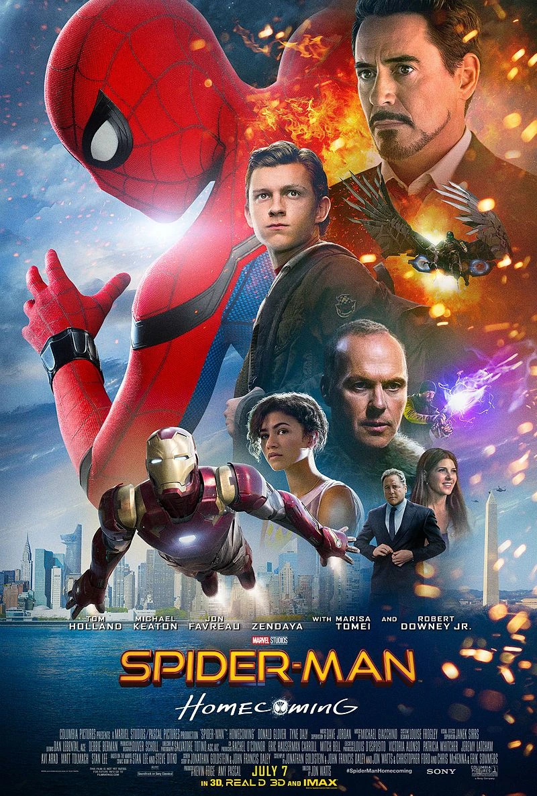
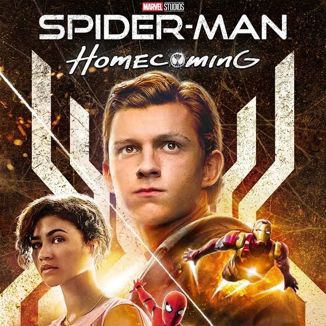
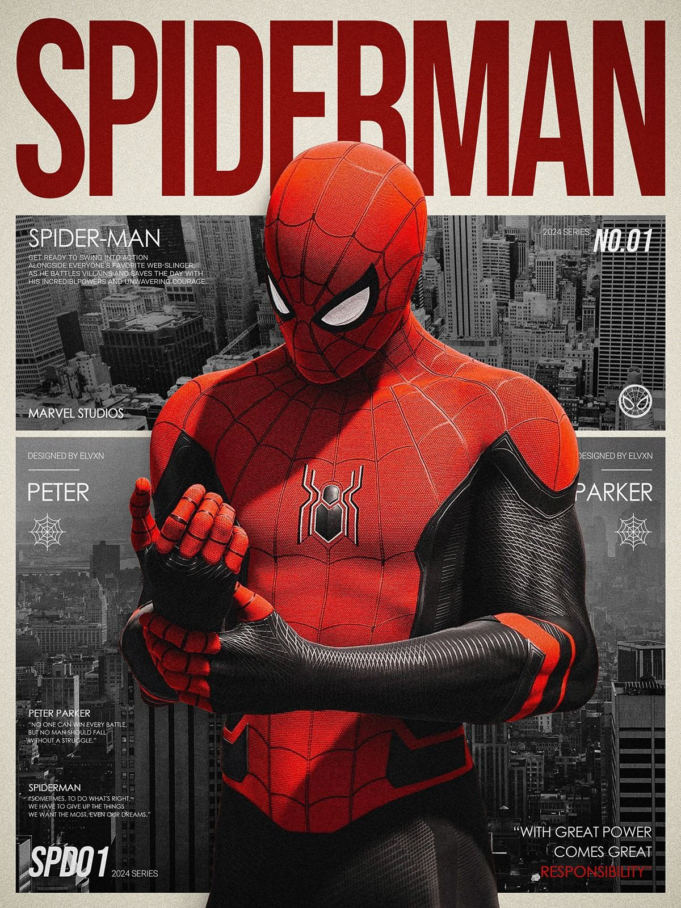

# 🕷️ Spider-Man: Homecoming



> **Spider-Man: Homecoming (2017)** is a Marvel Cinematic Universe superhero film directed by **Jon Watts** and starring **Tom Holland** as Peter Parker / Spider-Man.

---

## 🎬 Movie Overview

| Detail | Information |
|---|---|
| **Movie** | Spider-Man: Homecoming |
| **Release Year** | 2017 |
| **Genre** | Superhero, Action, Adventure, Comedy |
| **Director** | Jon Watts |
| **Main Character** | Peter Parker / Spider-Man |
| **Actor** | Tom Holland |
| **Studio** | Marvel Studios |
| **MCU Phase** | Phase Three |
| **Runtime** | 133 minutes |
| **Main Villain** | Adrian Toomes / Vulture |

---

## 🖼️ Movie Posters

### Main Poster



### Alternate Poster



---

# 📖 Story

## Introduction

**Peter Parker** is a young high-school student living in Queens, New York. After gaining spider-like abilities, Peter begins using his powers to protect people around his neighborhood.

Peter recently had an extraordinary experience when he was recruited by **Tony Stark / Iron Man** to help during the events of *Captain America: Civil War*. After returning home, Peter becomes eager to prove that he is ready to become a real superhero.

However, Tony Stark tells Peter to concentrate on his responsibilities as a teenager and stay close to home.

---

## 🕷️ Peter Parker's Double Life

Peter has to balance two very different lives.

During the day, he is an ordinary high-school student who attends classes with his best friend **Ned Leeds**. He deals with school, friendships, homework, and his feelings for **Liz Allan**.

At the same time, Peter secretly patrols his neighborhood as **Spider-Man**, helping people and stopping small-time criminals.

Peter believes that solving bigger crimes will prove that he deserves to become an official member of the Avengers.

---

## ⚙️ The Advanced Spider-Man Suit

Tony Stark provides Peter with an advanced Spider-Man suit containing several technological features.

The suit helps Peter analyze situations and gives him access to different Spider-Man abilities and tools.

Peter initially becomes fascinated with the suit's advanced technology. However, he gradually learns that the technology is not what makes him a hero.

> **Being Spider-Man is about responsibility, courage, and helping others.**

---

# 🦅 The Vulture

The main villain of the movie is **Adrian Toomes**, who becomes known as **the Vulture**.

Toomes and his team collect alien technology and advanced weapons left behind after major superhero battles. They modify this technology and sell it illegally.

Toomes uses the technology to create a powerful flying suit equipped with mechanical wings.

Peter eventually discovers that the Vulture is much more dangerous than the criminals he has previously encountered.

---

# ⚔️ Peter vs Vulture

Peter decides to investigate Toomes and stop his illegal activities.

However, Peter's lack of experience causes several problems. He sometimes acts without thinking and puts himself and others in danger.

Tony Stark becomes concerned about Peter's actions and eventually takes away his advanced Spider-Man suit.

Peter is disappointed but refuses to give up.

---

# 💪 The Turning Point

Without the advanced technology, Peter realizes that being a superhero is not about the suit.

He must rely on his own abilities, intelligence, courage, and determination.

Peter eventually confronts the Vulture during a major battle.

The fight tests Peter's physical abilities as well as his character.

Peter manages to stop the Vulture and prevent dangerous weapons from reaching other criminals.

---

# ❤️ Peter's Character Development

Throughout the movie, Peter learns several important lessons.

### At the beginning

Peter is:

- Excited about becoming an Avenger
- Eager to prove himself
- Dependent on advanced technology
- Sometimes reckless
- Inexperienced

### By the end

Peter becomes:

- More responsible
- More confident
- More independent
- More aware of the consequences of his actions
- More committed to helping people

Peter understands that being a hero is not about fame or recognition.

It is about doing the right thing when someone needs help.

---

# 👥 Main Characters

## 🕷️ Peter Parker / Spider-Man

**Actor:** Tom Holland

Peter is a talented teenager who gains spider-like powers and becomes Spider-Man.

He is intelligent, energetic, curious, and determined to become a better superhero.

---

## 🤖 Tony Stark / Iron Man

**Actor:** Robert Downey Jr.

Tony Stark becomes a mentor figure for Peter.

He provides guidance and technology while trying to teach Peter how to use his abilities responsibly.

---

## 🦅 Adrian Toomes / Vulture

**Actor:** Michael Keaton

Adrian Toomes is the main antagonist of the movie.

He uses advanced alien technology to create weapons and eventually becomes the Vulture.

---

## 🤝 Ned Leeds

**Actor:** Jacob Batalon

Ned is Peter's best friend and discovers Peter's secret identity.

He supports Peter and becomes involved in Spider-Man's activities.

---

## 💕 Liz Allan

**Actor:** Laura Harrier

Liz is Peter's classmate and the person Peter has a crush on.

Peter hopes to attend the school dance with her.

---

## 👩 Aunt May

**Actor:** Marisa Tomei

Aunt May is Peter's guardian.

She cares deeply about Peter and wants him to be safe.

---

## 🧑 Happy Hogan

**Actor:** Jon Favreau

Happy works closely with Tony Stark and becomes responsible for keeping an eye on Peter.

---

# 🏫 High School Life

One of the unique aspects of *Spider-Man: Homecoming* is its focus on Peter's life as a teenager.

The movie combines superhero action with:

- School life
- Friendship
- Crushes
- Academic competitions
- Social problems
- Teenager responsibilities

This makes Peter's journey feel different from many other superhero stories.

---

# 🔥 Major Themes

## Responsibility

Peter learns that having great abilities also means having responsibilities.

## Growing Up

Peter is not only learning how to become Spider-Man; he is also growing up as a teenager.

## Friendship

Ned plays an important role in Peter's life and supports him throughout the story.

## Mentorship

Tony Stark acts as a mentor and helps Peter understand what it means to be a hero.

## Heroism

The movie shows that being a hero is not about becoming famous or joining a famous superhero team.

True heroism comes from helping people and making responsible choices.

---

# 🌆 Setting

The story primarily takes place in:

- **Queens, New York**
- Peter's high school
- Local streets and neighborhoods
- Different locations connected to the Vulture's activities

The neighborhood setting gives Spider-Man a more personal and grounded environment.

---

# 🔗 Connection to the MCU

*Spider-Man: Homecoming* is part of the **Marvel Cinematic Universe**.

The movie follows Peter Parker's introduction in:

### `Captain America: Civil War (2016)`

After the events of *Civil War*, Peter returns to his normal life in Queens.

His relationship with Tony Stark continues throughout the movie.

---

# 🎞️ MCU Spider-Man Timeline

```text
Captain America: Civil War
          ↓
Spider-Man: Homecoming
          ↓
Avengers: Infinity War
          ↓
Avengers: Endgame
          ↓
Spider-Man: Far From Home
          ↓
Spider-Man: No Way Home